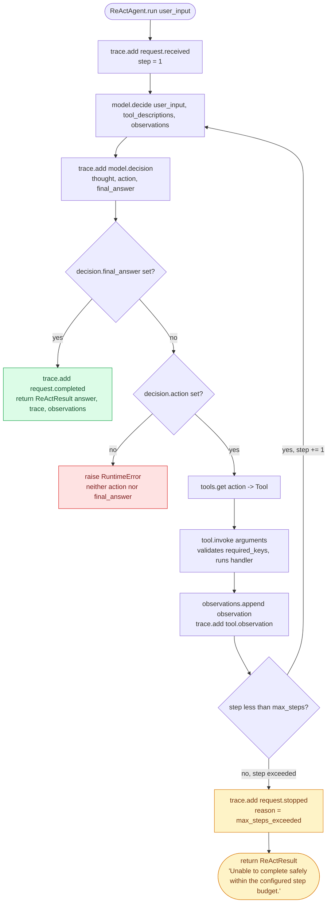

# Architecture Decision Record: ReAct Agent Pattern

## Context

Most AI teams start with a single prompt, then bolt on retrieval, API calls, calculators, search, business-system actions — one at a time. Without an orchestration pattern, the assistant either guesses when to reach for a tool, or loops through tool calls with no reliable stop condition. ReAct fixes that by making the cycle explicit: reason, act, observe, decide whether to continue.

## Decision

This repo implements ReAct as a bounded orchestration loop with four isolated responsibilities:

1. `ReasoningModel` decides the next thought, action, arguments, or final answer.
2. `ToolRegistry` owns available actions and validates tool existence.
3. `Tool` implementations own side effects, argument validation, and domain behavior.
4. `Trace` records every decision and observation for auditability.

I keep the agent from importing a model SDK or embedding tool logic directly. That boundary is deliberate — production systems need to swap model providers, enforce tool policies, add retries, and replay traces, without rewriting the orchestration core.

## When To Use

Use ReAct when the task is interactive, tool-driven, and relatively shallow:

- Enterprise copilots that query APIs or knowledge bases.
- Q&A over internal systems.
- Assistants that need calculators, search, retrieval, or ticket lookup.
- API assistants that choose among a known set of actions.

Avoid ReAct as the top-level pattern when work requires deep decomposition, multiple specialist roles, or long-running background execution. In those cases, ReAct is better used inside a Plan and Execute worker or a specialized multi-agent role.

## Runtime Flow

```text
User request
  -> model decides thought/action
  -> tool executes action
  -> observation is appended to short-term state
  -> model decides continue or final answer
```

The loop terminates when the model emits a final answer or when `max_steps` is reached. The step budget is a production control for cost, latency, and hallucination-loop containment.

The diagram below traces the exact control flow implemented in `ReActAgent.run()` (`src/react_agent_pattern/agent.py`), including the two ways the loop can end and the trace events emitted at each transition:



Three real exit paths, all present in `agent.py`:

- **Grounded finish** — `decision.final_answer` is set, the loop returns immediately with the model's answer (green).
- **Bounded safe-fail** — the loop exhausts `max_steps` (default `5`) without a final answer; it stops and returns the fixed sentinel `"Unable to complete safely within the configured step budget."` instead of looping forever (amber). This is the mechanism the bounded-loop benchmark exercises directly.
- **Adversarial raise** — the model returns neither an `action` nor a `final_answer`; `agent.py` raises `RuntimeError` rather than guessing (red). A malformed tool call (missing a required argument) fails the same way one level down, inside `Tool.invoke` in `tools.py`.

### Benchmark: bounded-loop safety is now measured, not just claimed

The "step budget as safety control" claim above used to be asserted in prose only. It is now backed by a real, executed benchmark: `scripts/benchmark_bounded_loop.py` runs 15 deterministic scenarios (success, runaway, and adversarial categories) twice each — once at the library's default `max_steps=5` and once at an unbounded surrogate `max_steps=200` — and records real step counts, tool-call counts, and outcomes. No LLM calls; every `ReasoningModel` used is a hand-written deterministic stub, so results are byte-identical on re-run.

Headline result (from [`docs/receipts/benchmark.md`](receipts/benchmark.md), generated by re-running the script): **9/15 trials (60%) succeed under bounded mode vs 10/15 (67%) under unbounded mode**, and unbounded mode burns **17.7x more total tool calls** (621 vs 35) — almost entirely the runaway scenarios running to the full 200-step cap instead of stopping at 5. The benchmark also shows honestly that the step budget does *not* protect against the two adversarial scenarios (malformed tool arguments, no action/no final_answer) — those fail identically at step 1 in both modes, because they are argument- and decision-validation failures, not non-termination failures. See `docs/receipts/benchmark.md` for the full per-trial table and methodology, and the README status table for the CI gate against `golden-eval-registry`.

## State Model

The reference implementation keeps state in a plain in-memory list of observations. In production, I'd split it into:

- Request state: user input, current observations, step count.
- Tool state: idempotency key, arguments, tool result, error details.
- Audit state: trace events, model metadata, policy decisions, token and cost accounting.
- Optional memory: retrieved facts or user preferences, never unfiltered chain-of-thought.

Persist traces to an append-only store. Persist business side effects through the tool layer with idempotency keys.

## Guardrails

- Tool allow-listing through `ToolRegistry`.
- Required argument validation at the tool boundary.
- Maximum step budget.
- Structured trace events for observability and incident review.
- Safe calculator sandbox in the sample tool.

Recommended production additions:

- JSON schema validation for model tool calls.
- Human approval gates for irreversible tools.
- Policy engine for user, tenant, and tool-level authorization.
- Circuit breakers per tool and per model provider.
- PII redaction before traces are exported.

## Failure Modes

- Tool hallucination: model asks for a tool that does not exist. Mitigation: registry validation and model output schema.
- Infinite reasoning loop: model repeatedly calls tools without finalizing. Mitigation: step budget and loop detectors.
- Stale observations: model over-trusts old tool outputs. Mitigation: timestamped observations and freshness policies.
- Cost runaway: unbounded tool/model calls. Mitigation: per-request budgets and admission control.

## Scaling Strategy

Start with an in-process agent for low-latency copilots. Move tools behind service interfaces as side effects grow. For high-volume systems, put each tool invocation behind a queue with idempotent handlers, distributed tracing, and result caching. ReAct itself should remain stateless between requests except for explicitly injected memory.

## Technology Choices

This repo uses only Python standard library code so the architecture is visible without framework noise. A production implementation can map the same boundaries to LangGraph nodes, OpenAI tool calling, Semantic Kernel planners, or a custom orchestration service.

## Success Metrics

- Tool-call precision and recall.
- First-pass grounded answer rate.
- Average tool calls per successful request.
- Step-budget exhaustion rate.
- Cost and latency per completed task.
- Human escalation rate for unsafe or ambiguous actions.

